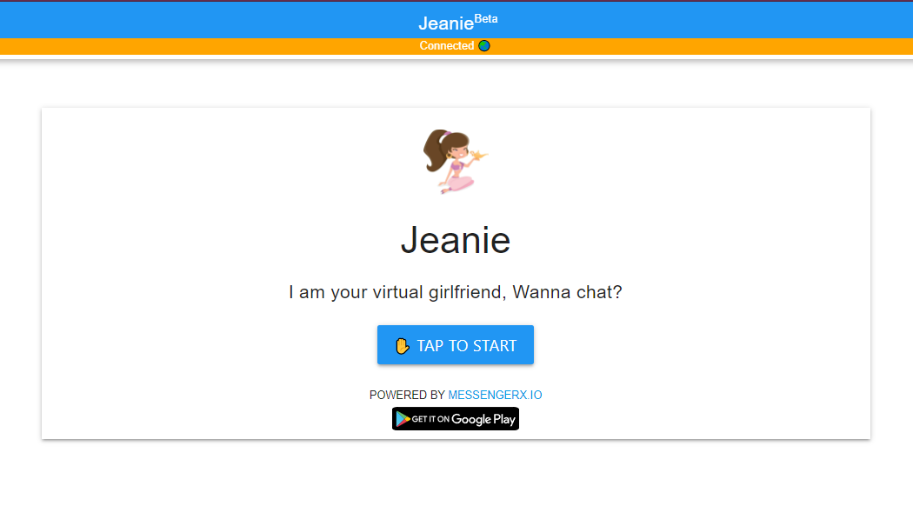
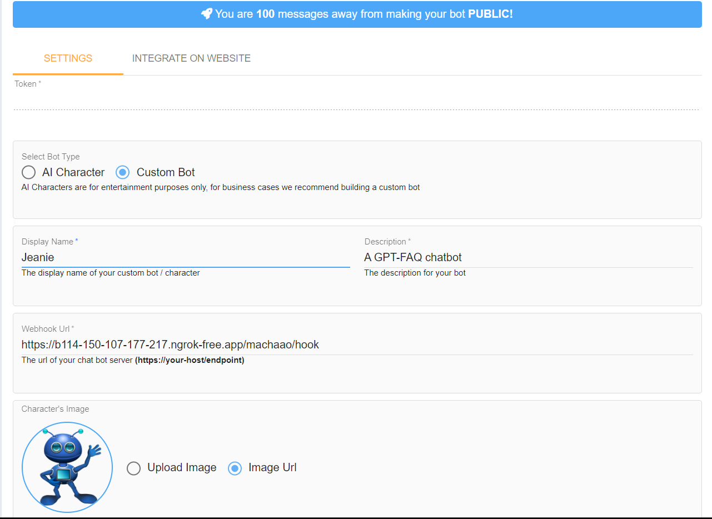

## A ChatGPT-esque Powered AI Chatbot Template (Powered by GPT-3) ##
The intent of this template is to serve as a reference guide for fellow developers 
looking to build and / or monetize AI GPT-3 chatbots on Web and Mobile.

## Live Web Demo ##


[Jeanie](https://messengerx.io/jeanie) is an AI powered virtual girlfriend based on the above code

## Requirements for running it locally on laptop ##
* Windows / Mac / Linux with Git installed
* Python 3.5+
* MessengerX.io API Token
* GPT-3 Token
* Ngrok for Tunneling

### Create a new .env file in the base directory ###
```bash
nano -w .env
```
```
API_TOKEN = <Machaao API Token>
OPENAI_API_KEY = <OpenAI Key> 
BASE_URL = <Machaao Base Url> ex: https://ganglia.machaao.com
NAME = <Your Bot Display Name> ex: Jess
DASHBOT_KEY = <Your dashbot token> (Optional) (Conversational Analytics)
```

## Get MessengerX.io API Key ##
* Signup via [MessengerX.io](https://portal.messengerx.io) and get a free bot token and replace it in the ```.env``` file under the entry ```API_TOKEN```
* MessengerX.io allows you to build and integrate a custom chatbot in your website or app or a shareable link.
* Create a Custom Bot and follow the setup process as listed below


## Get Open AI API Key ##
* You can acquire the API Key via [Open AI](https://openai.com) and replace it in the ```.env``` file under the entry
```OPEN_AI_KEY```
  
## Get Dashbot.io API KEY (Recommended for Production) ##
* You can acquire the API Key via [Dashbot.io](https://dashbot.io) and replace it in the ```.env``` file under the entry
```DASHBOT_KEY```
  
## Local Setup ##
### Download or clone this repository ###
```
git clone git@github.com:machaao/gpt-3-chatbot.git

cd gpt-3-chatbot
```


### Install requirements ###
```bash
pip install -r requirements.txt
```


### Modify logic/prompt.txt to change the character ###
```
This is a discussion between [user] and [name]
[name] is a very understanding girl.
```

### Modify the core() function in logic/bot_logic.py to personalize responses ###
```
def core(self, req: str, user_id: str):
```
* Refer to [platform documentation](https://messengerx.rtfd.iio) for messaging payloads

### Run the chatbot server from the root directory of the repo ###
```
python app.py
```

### Start ngrok.io tunnel ###
```
ngrok http 5000
```

### Update your webhook ###
Update your bot Webhook URL at [MessengerX.io Portal](https://portal.messengerx.io) with the url provided as shown below to continue development
```
Webhook Url: https://<TUNNEL-HOST>/webhooks/machaao/incoming
```
If you use [Ngrok.io](https://ngrok.io), your webhook URL would be of the format as in the example below
```
https://1234-115-187-40-104.ngrok.io/webhooks/machaao/incoming 
```


### Test your bot:
Visit: ```https://messengerx.io/<bot-name>```


## Remote Setup (Heroku) ##

We are assuming you have access to a [heroku account](https://heroku.com)
and have installed heroku command line client for your OS.

### Login to Heroku ###
```
heroku login
```

### Create a new app on Heroku and note down your heroku app name
```
heroku create
```

### Commit changes and push the repository to Heroku ###
```
git commit -m ".env updated"
git push heroku master
```

### Open the logs to confirm successful Deployment ###
```
heroku logs --tail
```

### Update your webhook ###
Update your bot Webhook URL at [MessengerX.io Portal](https://portal.messengerx.io) with the heroku app url
```
Webhook Url: <YOUR-HEROKU-APP-URL>/webhooks/machaao/incoming
```

### Share your bot:
Visit: ```https://messengerx.io/<your-bot-name>```


## Notes / Additional Resources ##
* Please note that this document isn't meant to be used as a guide for production environment setup.
* Please note to get a downloadable APK for your character, please contact us at [connect@machaao.com](mailto:connect@machaao.com)

[](https://gitter.im/messengerx-io/community?utm_source=badge&utm_medium=badge&utm_campaign=pr-badge)  
