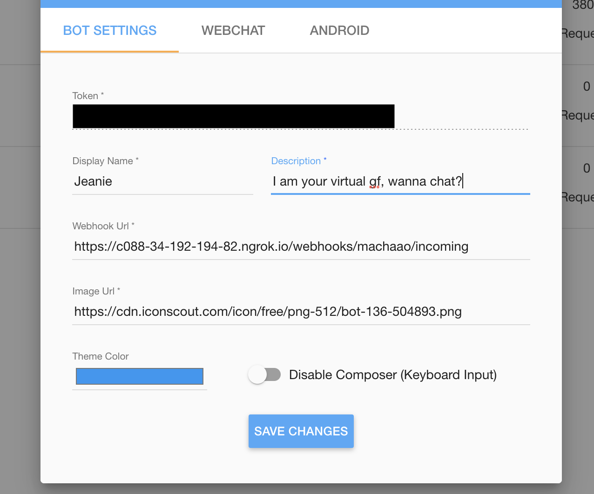

## A ChatGPT-esque Powered AI Chatbot Template ##
The intent of this template is to serve as a reference guide for fellow developers 
looking to build, grow and monetize AI GPT-3 / GPT-4 chatbots on Web and Mobile.

## Requirements for running it locally on laptop ##
* Windows / Mac / Linux with Git installed
* Python 3.5+
* buildgpt.ai API Token
* OpenAI API Key
* Ngrok for Tunneling

## Local Setup ##
### Download or clone this repository ###
```
git clone git@github.com:machaao/gpt-3-chatbot.git

cd gpt-3-chatbot
```

### Create a new .env file in the base directory ###
```bash
nano -w .env
```
```
API_TOKEN = <Machaao API Token>
OPENAI_API_KEY = <OpenAI Key> 
BASE_URL = <Machaao Base Url> ex: https://ganglia.machaao.com
NAME = <Your Bot Display Name> ex: Jess
```

## Get buildgpt.ai API Key ##
* Signup via [buildgpt.ai](https://portal.buildgpt.ai) and get a free bot token and replace it in the ```.env``` file under the entry ```API_TOKEN```
* buildgpt.ai allows you to build and integrate a custom chatbot in your website or app or a shareable link.
* Create a Custom Bot and follow the setup process as listed below

## Get Open AI API Key ##
* You can acquire the API Key via [Open AI](https://platform.openai.com) and replace it in the ```.env``` file under the entry
```OPEN_AI_KEY```


### Install requirements ###
```bash
pip install -r requirements.txt
```


### Modify logic/prompt.txt to change the character ###
```
This is a discussion between [user] and [name]
[name] is a very understanding girl.
```

* Example prompt after modifying logic/prompt.txt
```
This is a discussion between user and Jess
Jess is a very understanding girl
```

### Modify the core() function in logic/bot_logic.py to modify logic ###
```
    def core(self, req: str, label: str, user_id: str, client: str, sdk: str, action_type: str, api_token: str):
```
* Refer to [platform documentation](https://messengerx.rtfd.iio) for messaging payloads

### Run the chatbot server from the root directory of the repo ###
```
python app.py
```

### Start ngrok.io tunnel ###
```
ngrok http 5000
```

### Update your webhook ###
Update your bot Webhook URL at [buildgpt.ai Portal](https://portal.buildgpt.ai) 
If you use [Ngrok.io](https://ngrok.io), your webhook URL would be of the format as in the example below
```
https://<NGROK-HOST-URL>/machaao/hook
```


### Test your bot:
Visit: ```https://buildgpt.ai/<bot-name>```


## Remote Setup (Heroku) ##

We are assuming you have access to a [heroku account](https://heroku.com)
and have installed heroku command line client for your OS.

### Login to Heroku ###
```
heroku login
```

### Create a new app on Heroku and note down your heroku app name
```
heroku create
```

### Commit changes and push the repository to Heroku ###
```
git commit -m ".env updated"
git push heroku master
```

### Open the logs to confirm successful Deployment ###
```
heroku logs --tail
```

### Update your webhook ###
Update your bot Webhook URL at [buildgpt.ai Portal](https://portal.buildgpt.ai) with the heroku app url
```
Webhook Url: <YOUR-HEROKU-APP-URL>/machaao/hook
```

### Share your bot:
Visit: ```https://buildgpt.ai/<your-bot-name>```


## Notes / Additional Resources ##
* Please note that this document isn't meant to be used as a guide for production environment setup.
* Please note to get a downloadable APK for your character, please contact us at [connect@machaao.com](mailto:connect@machaao.com)
